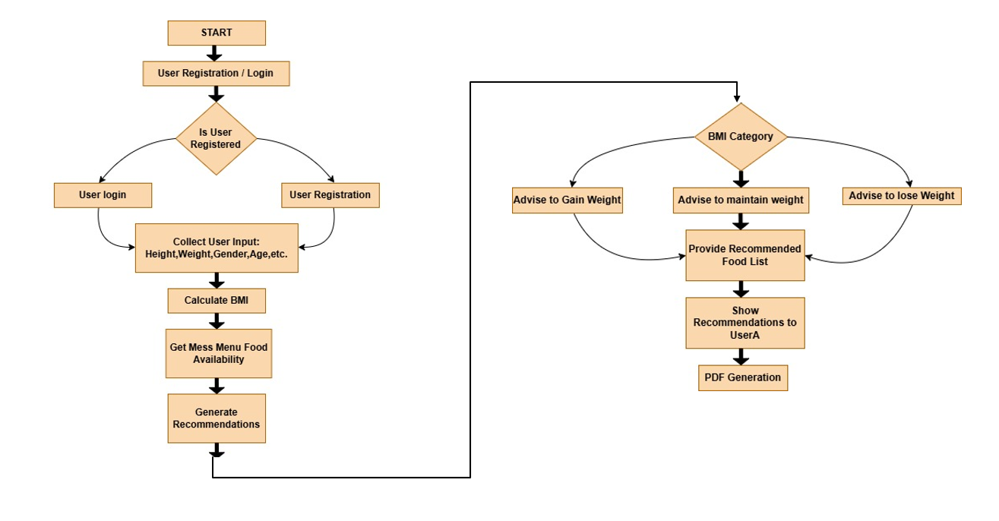
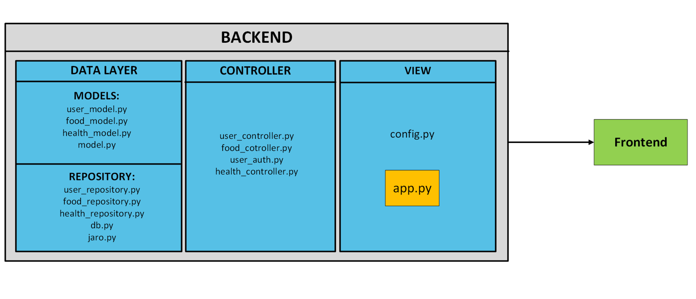
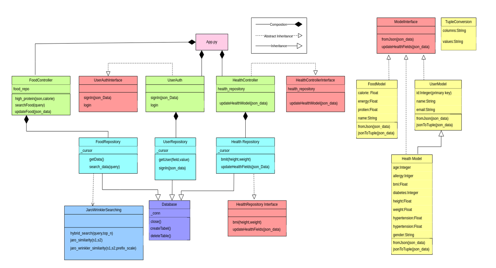

# Nutrify: Personalized Nutrition Recommendation Engine

## Overview

Maintaining a healthy lifestyle is a significant challenge in today’s fast-paced environment, especially for individuals with limited access to varied food options and structured fitness routines. This project, the Personalized Nutrition Recommendation Engine, aims to address this challenge by integrating customized diet plans with tailored workout routines into a unified platform. The system is particularly designed for individuals in controlled environments, such as hostels or other institutions, where food accessibility is predefined.

## Problem Statement

Many students struggle to track their daily nutrition and make informed food choices, leading to poor dietary habits. Nutrify helps users analyze their BMI, track food intake, and receive optimized meal recommendations based on calorie/protein needs.

## Abstract

Nutrify is a Personalized Nutrition Recommendation Engine designed to help users, particularly students, make informed dietary choices. The system leverages Python, SQL, and advanced algorithms to provide meal recommendations based on user-specific parameters such as age, weight, height, and activity level. Using Trie for fast food search, Knapsack Algorithm for optimized meal selection, and BMI calculations, Nutrify offers a comprehensive approach to tracking nutrition and optimizing food intake. Users can upload the food items available to them for each day of the week, and Nutrify will generate personalized meal recommendations based on their accessibility and nutritional needs. The platform features an efficient SQL database, a Flask-based backend, and a user-friendly frontend built with HTML and CSS for seamless interaction.

## Key Contributions

This project is notable for its robust architectural and algorithmic foundation:

* **Foundation in OOPS and DSA Principles:** The project is built extensively using core Object-Oriented Programming (OOP) and Data Structures and Algorithms (DSA) concepts. This includes the application of:
    * **OOP Concepts:** Inheritance, where a new class can reuse or copy features (like properties and methods) from an existing class. Abstraction, meaning hiding details and only showing important parts, using abstract methods (no code) and concrete methods (with code). Encapsulation, keeping data and methods safe inside a class and controlling access to them. MVC Architecture (Model for data, View for UI, and Controller for logic) to keep everything organized and separate. And Singleton Architecture, where only one instance of a class is created, using static methods and variables to provide global access to that instance. This design pattern ensures a single source of truth for each model’s data, reduces memory usage by avoiding multiple repository instances, and enables centralized and consistent data access across controllers.
    * **DSA Concepts:**
        * **Algorithms:** BMI Calculation ($O(1)$ time and space complexity), Jaro Winkler ($O(NM)$ time and $O(N+M)$ space complexity, where N and M are the length of the first and second string respectively), Knapsack Algorithm ($O(NW)$ time and $O(NW)$ space complexity, where N is the number of samples and W is the weight of the sample), and Greedy Algorithm ($O(N \log N)$ time and $O(N)$ space complexity).
        * **Data Structures:** Dictionary (for data conversion), List (for storing user meal entries), and Tuple (used in data manipulation and storing). A Trie is also used for fast food search.
* **Core Implementations:** The project emphasizes implementing its functionalities using fundamental programming constructs and algorithms. For instance, it details the Jaro Winkler similarity calculation and the application of the Knapsack Algorithm for optimized meal selection, demonstrating a deep engagement with core algorithmic problem-solving.
* **Personalized and Context-Aware Recommendations:** Nutrify dynamically generates diet plans based on individual user profiles (age, weight, height, activity level) and the specific food items available to them.
* **Comprehensive Nutritional Tracking and Output:** The system not only helps users track food intake but also provides BMI calculations and outputs a recommended food list, including a downloadable nutrition report.

## System Architecture

### Flowchart

The system workflow is as follows:
1.  **Start**
2.  **User Registration / Login:** Users can register or log in.
3.  **Collect User Input:** Gathers details like height, weight, gender, age, etc.
4.  **Calculate BMI**
5.  **Get Mess Menu Food Availability**
6.  **Generate Recommendations**
7.  **BMI Category Analysis:** Based on BMI, advises to gain, maintain, or lose weight.
8.  **Provide Recommended Food List**
9.  **Show Recommendations to User**
10. **PDF Generation**

### Backend Architecture

The backend follows an MVC (Model-View-Controller) architecture:

* **Data Layer:**
    * **Models:** `user_model.py`, `food_model.py`, `health_model.py`, `model.py`
    * **Repository:** `user_repository.py`, `food_repository.py`, `health_repository.py`, `db.py`, `jaro.py`
* **Controller:** `user_controller.py`, `food_controller.py`, `user_auth.py`, `health_controller.py`
* **View:** `config.py`, `app.py`

This backend communicates with the Frontend.

### Singleton Design Pattern

The project utilizes a Singleton Design Pattern for its repositories (`User Repository`, `Food Repository`, `Health Repository`) interacting with the Database. This design ensures a single source of truth for each model’s data, reduces memory usage by avoiding multiple repository instances, and enables centralized and consistent data access across controllers.

## Algorithms and Data Structures Used

| ALGORITHM          | TIME COMPLEXITY                         | SPACE COMPLEXITY |
| :----------------- | :-------------------------------------- | :--------------- |
| BMI CALCULATION    | $O(1)$                                  | $O(1)$           |
| JARO WINKLER       | $O(NM)$ (N,M – Length of first and second string) | $O(N+M)$ |
| KNAPSACK           | $O(NW)$ (N-No. of samples and W-weight of the sample) | $O(NW)$ |
| GREEDY             | $O(N \log N)$                             | $O(N)$ |

| DATA STRUCTURE | PURPOSE                     |
| :------------- | :-------------------------- |
| Dictionary     | For data conversion         |
| List           | Storing user meal entries   |
| Tuple          | Used in data manipulation and storing |

*A Trie data structure is also used for fast food search.*

## Jaro and Jaro Winkler Similarity Overview

### Jaro Similarity

The Jaro Similarity is calculated using the following formula:

$Jaro\;similarity = \begin{cases} 0 & \text{if } m=0 \\ \frac{1}{3}\left(\frac{m}{|s1|} + \frac{m}{|s2|} + \frac{m-t}{m}\right) & \text{for } m! = 0 \end{cases}$

where:
* $m$ is the number of matching characters
* $t$ is half the number of transpositions
* $|s1|$ and $|s2|$ are the lengths of strings s1 and s2 respectively.

*Characters are considered matching if they are the same and within a distance of $\left\lfloor\frac{\max(|s1|, |s2|)}{2}\right\rfloor - 1$. Transpositions are half the number of matching characters in both strings but in a different order*.

**Example Calculation:**
Let s1="arnab", s2="raanb".
* It is evident that both the strings have 5 matching characters, but the order is not the same, so the number of characters that are not in order is 4, so the number of transpositions is 2.
* Therefore, Jaro similarity can be calculated as follows: Jaro Similarity = $(1/3) * ((5/5) + (5/5) + (5-2)/5) = 0.86667$

### Jaro Winkler Similarity

Jaro Winkler similarity is defined as follows:

$S_w = S_j + P * L * (1 - S_j)$

where:
* $S_j$ is Jaro similarity
* $S_w$ is Jaro-Winkler similarity
* $P$ is the scaling factor (0.1 by default)
* $L$ is the length of the matching prefix up to a maximum of 4 characters.

**Example Calculation:**
Let s1="arnab", s2="aranb".
* The Jaro similarity of the two strings is 0.933333 (From the above calculation.)
* The length of the matching prefix is 2 and we take the scaling factor as 0.1.
* Substituting in the formula; Jaro-Winkler Similarity= $0.933333 + 0.1 * 2 * (1-0.933333) = 0.946667$

**Time Complexity:** $O(N * M)$, where N is the length of string s1 and M is the length of string s2.
**Auxiliary Space:** $O(N + M)$.

## UML

## Future Enhancements

Future enhancements for Nutrify include AI-powered meal recommendations, mobile integration, and food image recognition for an even smarter dietary planning system.
